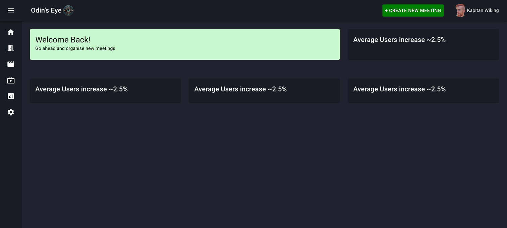
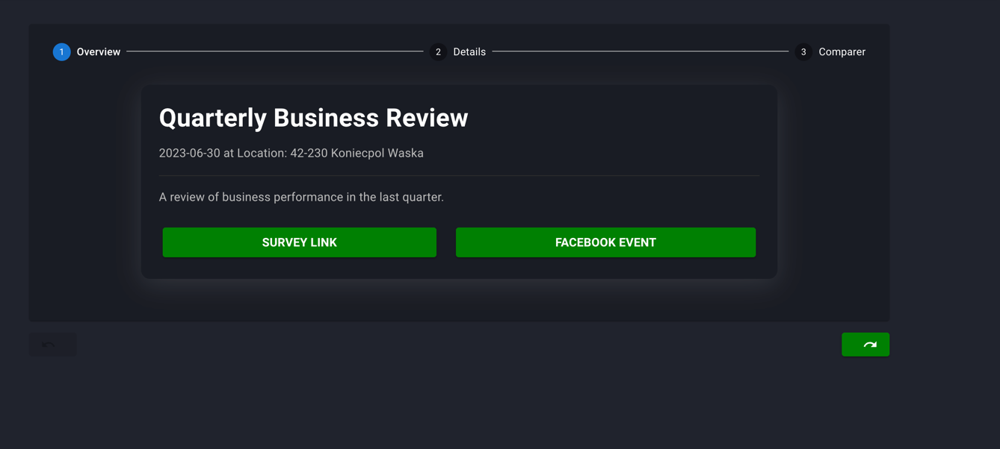
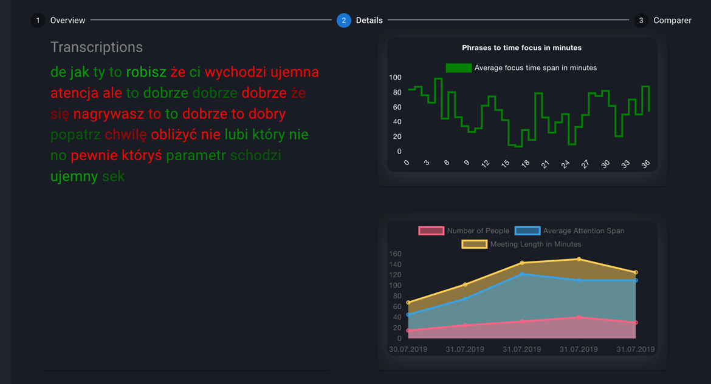
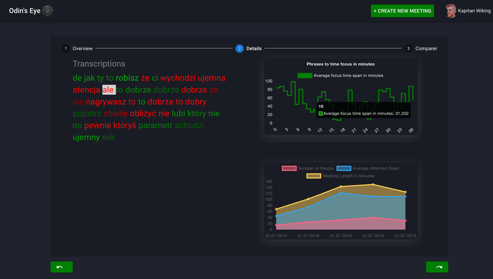
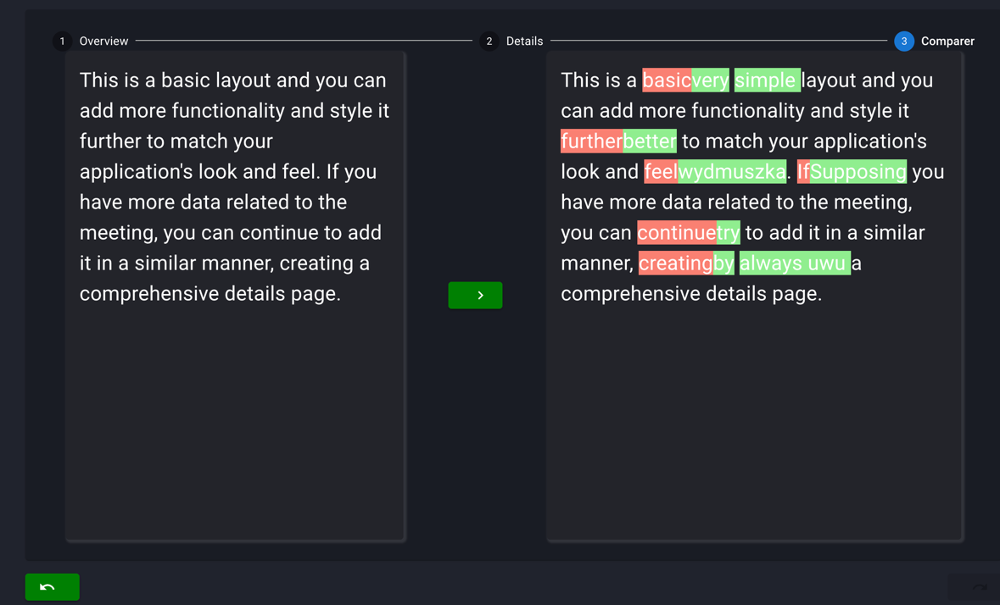
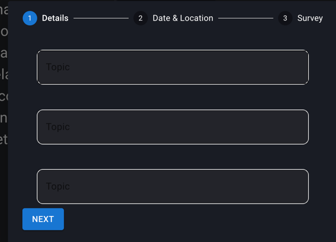
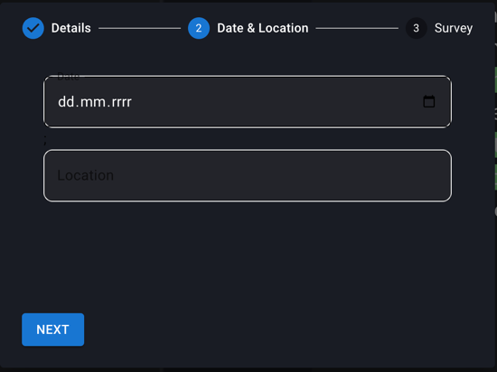
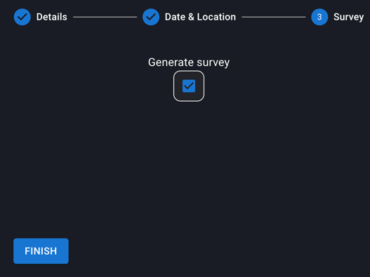
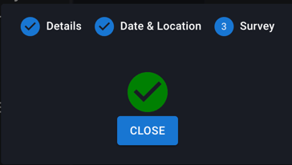

# Odyn's Eye Admin Panel

Odyn's eye admin panel is one of the 4 components, which is in charge
of retrieving data with analysis, as well as, human readable conclusions.

## Getting Started

These instructions will get you a copy of the project up and running on your local machine for development and testing purposes.

### Prerequisites

In order to start it up You have to have facebookClientId due to secured paths
with oauth2 based login.

After suppliing it, also all components are required for proper functioning.

### Local deployment

As it is not common, it is worth mentioning that this app is 
deployed locally on *https* not ~~http~~

## Routing
```
├── '/'
│   ├── meetings
│       └── :meetingId
│        
└── settings
│
└── live
│
└── home
│
└── analysis
│
└── recordings
```


```Disclaimer
Many endpoints are under development, hence there are many functionalities
not implemented due to time limitation. Most developed is meetings path as it is core functionality.
```

### Oauth2
We have implemented Oauth2 login with facebook which is responsible for
veryfing user identity (and in future) to be taken advantage of fe. To schedule facebook events.

### Welcome screen

After login user is presented with simple welcome 
screen (which is simply just as a placeholder)

### Meeting 

After navigating to meeting screens user is able to browse already 
ended meetings, as well as possibility to browse not scheduled. 

### Meeting overview






### New Meeting Creation




